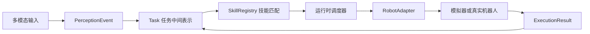

# OpenEI

OpenEI 是面向低成本真实机器人的轻量级具身 Agent 运行时。它把文本、语音、音频、视觉、传感器等输入统一成任务事件，再经过模型解析、任务规划、技能调度、安全约束和机器人适配器，变成真实或模拟机器人的身体能力调用。

一句话定位：OpenClaw 让 Agent 调用软件工具，OpenEI 让 Agent 调用真实机器人的身体能力。



## 五分钟闭环

不需要 API key，不需要真实硬件，先跑完整闭环：

```bash
pip install -r requirements.txt
python -m openei quickstart --task "执行 10 秒"
```

示例输出：

```text
OpenEI 五分钟模拟器
输入事件: text / 执行 10 秒
任务目标: 执行 10 秒
任务类型: motion
任务状态: succeeded
风险等级: low
时长约束: 10 秒

匹配技能:
  1. motion.挥左拳 (3.1 秒)
  2. motion.挥右拳 (3.6 秒)
  3. motion.safe_stand (2.0 秒)

模拟执行日志:
  [执行序列] 第 1 步: motion.挥左拳
  [模拟硬件] 调用技能 motion.挥左拳
  控制序号: 007
```

接入串口机器人后，把适配器切到真实硬件：

```bash
SERIAL_PORT=/dev/ttyUSB0 python -m openei run --adapter serial --task "执行 10 秒"
```

视觉输入样例：

```bash
python -m openei quickstart --image examples/image_input/scene.jpg --task "根据画面执行安全动作"
```

## 为什么不是传统机器人脚本

传统脚本通常把“输入命令、动作编号、硬件通信”写成固定流程，换输入源、换模型、换机器人都要改主逻辑。OpenEI 的目标是把这几层拆开：

- 输入层只负责产生 `PerceptionEvent`，支持文本、语音、音频、图像、视频和传感器。
- 模型层通过 `ModelProvider` 把事件解析成 `Task`，内置离线规则模式不需要密钥。
- 技能层把机器人能力抽象成可注册、可校验、可模拟、可执行的 `Skill`。
- 适配层用 `RobotAdapter` 屏蔽模拟器、串口、HTTP、MQTT 和 ROS 2 差异。
- 运行时负责规划、风险检查、执行、失败恢复和审计日志。

## 核心能力

- 多模态接入：`openei.events` 统一文本、语音、音频、图像、视频和传感器事件。
- 任务中间表示：`openei.tasks` 记录目标、类型、上下文、约束、风险等级、安全策略和期望结果。
- 技能生态：`SkillRegistry` 支持内置动作数据、`skill.yaml` 技能包、校验、安装、运行。
- 执行运行时：`OpenEIRuntime` 实现 `输入事件 -> 模型解析 -> 安全规划 -> 适配器执行 -> 审计日志`。
- 硬件适配：内置模拟器、串口、HTTP、MQTT 和可选 ROS 2 适配器模板。
- 可观测性：执行过程写入 JSONL 审计日志，支持失败恢复和任务回放。

## 统一命令行

```bash
python -m openei quickstart --task "执行 10 秒"
python -m openei run --adapter sim --task "执行 10 秒"
python -m openei skill list
python -m openei skill validate skill_packages/base_motion
python -m openei robot validate robot.yaml
python -m openei adapter test --adapter sim
python -m openei replay logs/openei_audit.jsonl
python -m openei adapter create my_robot
```

## 常规启动

Linux / Orange Pi 推荐：

```bash
bash scripts/run_demo.sh
```

Windows 本地验证：

```powershell
powershell -ExecutionPolicy Bypass -File .\scripts\run_demo.ps1
```

手动启动：

```bash
python main.py --profile demo --transport auto --recording-mode smart_vad
```

运行模式：

- `--profile demo`：展示档位，启用启动自检、状态面板和高风险任务确认。
- `--profile dev`：开发档位，提供更直接的本地调试体验。
- `--transport auto`：优先连接真实硬件，失败后自动切换模拟执行。
- `--transport real`：强制真实硬件模式。
- `--transport sim`：强制模拟执行模式。
- `--recording-mode smart_vad`：智能录音模式。
- `--no-tts`：禁用语音播报，仅输出文本反馈。

## 目录说明

- `openei/`：核心框架层，包含任务模型、技能系统、机器人适配器、运行时和快速模拟器。
- `config/`：运行配置、音频参数、硬件通信参数和运行档位。
- `core/`：感知特征处理、时序分析和连续技能序列调度逻辑。
- `dance/`：机器人底层技能库、控制器和串口驱动模块。
- `voice/`：录音、语音识别、语音合成、意图解析和交互运行时。
- `data/`：机器人技能元数据。
- `skill_packages/`：官方技能包样例。
- `robot.yaml`：机器人能力、限制、安全停止技能、适配器和技能包声明。
- `examples/`：模拟器、图像输入、串口、HTTP、MQTT 和 ROS 2 模板。
- `docs/`：架构、快速开始、技能开发、适配器开发和展示材料。
- `tests/`：单元测试、接口契约测试和端到端链路测试。

## 文档

- [架构说明](docs/architecture.md)
- [快速开始](docs/quickstart.md)
- [技能开发](docs/skills.md)
- [机器人适配器](docs/adapters.md)
- [模型提供方](docs/model_providers.md)
- [可观测性与审计](docs/observability.md)
- [ROS 2 可选接入](docs/ros2.md)
- [发布记录](CHANGELOG.md)
- [长期路线](ROADMAP.md)

## 工程建议

- 新用户先跑 `python -m openei quickstart --task "执行 10 秒"`，确认无硬件闭环可用。
- 用 `python -m openei robot validate robot.yaml` 校验机器人能力、限制和适配器声明。
- 用 `python -m openei adapter test --adapter sim` 验证适配器满足运行时契约。
- 再用 `--transport sim` 验证完整语音和任务链路。
- 接入真实机器人前，先检查串口权限、设备路径和供电状态。
- 现场网络不稳定时，对话能力会降级为固定反馈，不影响任务执行主链路。
