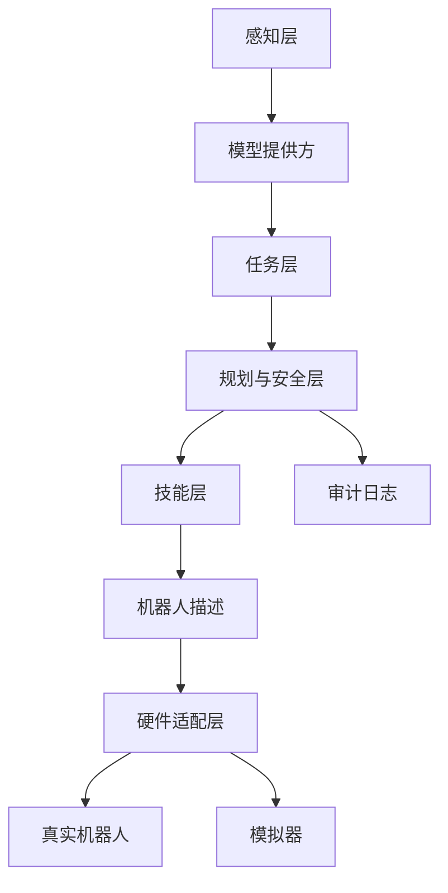

# OpenEI 架构说明

OpenEI 是轻量级具身智能体运行时。它将机器人能力从单一脚本流程中解耦，拆分为感知事件、模型提供方、任务中间表示、技能系统、机器人描述、执行运行时、安全策略、审计日志和硬件适配层。

## 分层结构



## 感知层

感知层负责把外部输入统一成 `PerceptionEvent`：

- `modality`：输入类型，例如文本、语音、音频、视觉、传感器。
- `content`：输入内容。
- `source`：输入来源，例如命令行、语音助手、摄像头、传感器。
- `metadata`：置信度、时间戳、设备信息等扩展字段。

OpenEI 提供文本、语音、音频和图像文件入口；实时视觉和传感器可以通过同一个事件模型接入运行时。

## 模型提供方

`ModelProvider` 负责把 `PerceptionEvent` 转成 `Task`。`RuleModelProvider` 提供无密钥离线解析；`CloudModelProvider` 和 `LocalModelProvider` 使用同一任务接口承接云端模型和本地模型。

## 任务层

任务层把输入转成 `Task`：

- `goal`：用户目标。
- `task_type`：运动、巡检、视觉触发、传感器触发等任务类型。
- `parameters`：时长、目标对象、技能标签等参数。
- `constraints`：最大执行时长、是否需要硬件、风险约束等。
- `risk_level`：低、中、高风险等级。
- `safety_policy`：普通执行、需要确认、失败停止、仅模拟等安全策略。
- `expected_result`：期望结果描述。
- `source`：任务来源。
- `status`：任务状态。
- `created_at`：创建时间。

这个中间表示让上层模型和下层硬件之间有一层稳定边界。

## 技能层

技能层用 `Skill` 表示机器人能力：

- `name`：技能名。
- `description`：能力描述。
- `parameters_schema`：参数定义。
- `preconditions`：前置条件。
- `handler`：真实执行函数。
- `simulator`：模拟执行函数。

`SkillRegistry` 负责注册、查询、标签匹配和列出技能。内置动作数据和 `skill.yaml` 技能包会统一注册为 `Skill`。

## 机器人描述

`robot.yaml` 声明机器人名称、能力、限制、安全停止技能、支持适配器和技能包。运行时读取机器人描述后，可以用最大时长、安全停止技能和适配器约束辅助规划。

常用命令：

```bash
python -m openei robot validate robot.yaml
python -m openei robot show robot.yaml
```

## 运行时调度层

`OpenEIRuntime` 的主流程：

```text
PerceptionEvent -> ModelProvider -> Task -> RulePlanner -> RobotAdapter -> ExecutionResult -> AuditLogger
```

内置规划器采用轻量规则：从任务时长、技能标签、风险等级和安全策略中匹配可执行技能，组合成连续执行序列，并在最后追加归位类技能。规划器接口也可以接入模型规划、规则引擎或学习型策略。

## 硬件适配层

`RobotAdapter` 是机器人抽象接口：

- `connect()`
- `status()`
- `execute_skill(skill, task)`
- `stop()`
- `close()`

内置适配器：

- `SimRobotAdapter`：无硬件模拟完整闭环，并输出状态事件。
- `SerialRobotAdapter`：负责串口控制板动作序号下发。
- `HttpRobotAdapter`：面向 REST 控制器或廉价网关。
- `MqttRobotAdapter`：面向物联网控制板或远程机器人。
- `Ros2RobotAdapter`：ROS 2 机器人适配模板，以可选依赖方式接入。

这个边界让新机器人接入时只需要写适配器，不必重写任务层和技能层。
