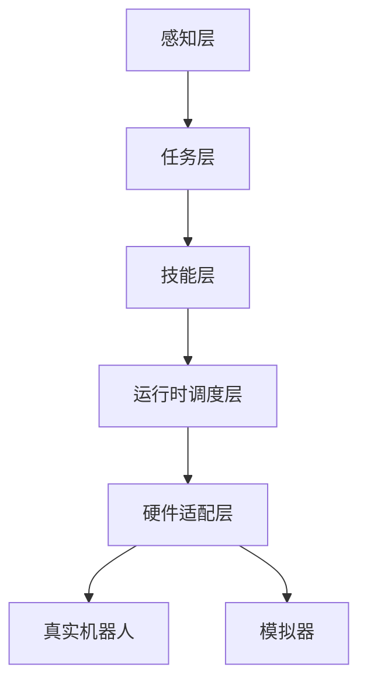

# OpenEI 架构说明

OpenEI 的主线定位是轻量级具身 Agent 运行时原型。它不把机器人能力写死成单个脚本，而是拆成感知事件、任务中间表示、技能系统、执行运行时和硬件适配层。

## 分层结构



## 感知层

感知层负责把外部输入统一成 `PerceptionEvent`：

- `modality`：输入类型，例如文本、语音、音频、视觉、传感器。
- `content`：输入内容。
- `source`：输入来源，例如命令行、语音助手、摄像头、传感器。
- `metadata`：置信度、时间戳、设备信息等扩展字段。

当前仓库已有文本、语音和音频链路。视觉和传感器输入后续可以通过同一个事件模型接入，不需要推翻运行时。

## 任务层

任务层把输入转成 `Task`：

- `goal`：用户目标。
- `parameters`：时长、目标对象、技能标签等参数。
- `constraints`：最大执行时长、是否需要硬件、风险约束等。
- `risk_level`：低、中、高风险等级。
- `source`：任务来源。
- `status`：任务状态。
- `created_at`：创建时间。

这个中间表示让上层模型和下层硬件之间有一层稳定边界。

## 技能层

技能层用 `Skill` 表示机器人能力：

- `name`：技能名。
- `description`：能力描述。
- `parameters_schema`：参数定义。
- `preconditions`：前置条件。
- `handler`：真实执行函数。
- `simulator`：模拟执行函数。

`SkillRegistry` 负责注册、查询、标签匹配和列出技能。当前默认技能包由 `data/actions.csv` 迁移而来，保留原 CSV 兼容路径。

## 运行时调度层

`OpenEIRuntime` 当前实现的主流程：

```text
PerceptionEvent -> Task -> Skill plan -> RobotAdapter -> ExecutionResult
```

第一阶段规划器采用轻量规则：从任务时长和技能标签中匹配可执行技能，组合成连续执行序列，并在最后追加归位类技能。后续可以把规划器替换为多模型推理、规则引擎或学习型策略。

## 硬件适配层

`RobotAdapter` 是机器人抽象接口：

- `connect()`
- `status()`
- `execute_skill(skill, task)`
- `stop()`
- `close()`

内置适配器：

- `SimRobotAdapter`：无硬件模拟完整闭环。
- `SerialRobotAdapter`：包装现有串口控制逻辑，复用当前控制板动作序号。

这个边界让新机器人接入时只需要写适配器，不必重写任务层和技能层。
